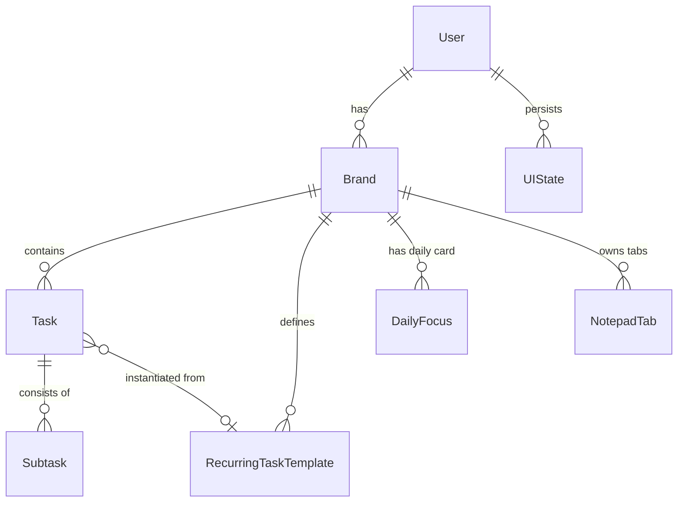

# Data Models for Personal Tracker

This document defines the database schema and data models for migrating the Personal Task Board from its static HTML/localStorage implementation to a robust, relational full-stack architecture.

---

## 1. Entity-Relationship Diagram (ERD)

The following Mermaid diagram outlines the relational structure of the daily tracker database:



---

## 2. Prisma Schema Definition

Prisma is the recommended ORM for this Next.js app due to its strong typing, developer experience, and multi-database support (PostgreSQL, SQLite, MySQL).

Below is the complete `schema.prisma` file, designed to support either **SQLite** (for easy self-hosting/local development) or **PostgreSQL** (for cloud database hosting like Supabase/Neon).

```prisma
datasource db {
  provider = "postgresql" // Or "sqlite" for local/self-hosting
  url      = env("DATABASE_URL")
}

generator client {
  provider = "prisma-client-js"
}

// ── USER MODEL ─────────────────────────────────────────────────────────────
// Supports authentication and secure multi-tenancy.
model User {
  id           String    @id @default(uuid())
  email        String    @unique
  passwordHash String?   // Nullable to support OAuth providers (Google, GitHub)
  name         String?
  createdAt    DateTime  @default(now())
  updatedAt    DateTime  @updatedAt

  brands       Brand[]
  uiStates     UIState[]

  @@map("users")
}

// ── BRAND MODEL ─────────────────────────────────────────────────────────────
// Represents workspaces/categories (e.g., "Personal", "Work", "Side Projects").
model Brand {
  id        String   @id @default(uuid())
  userId    String
  user      User     @relation(fields: [userId], references: [id], onDelete: Cascade)
  name      String   // E.g., "Personal", "Work"
  emoji     String   // E.g., "🏠", "💼"
  color     String   // E.g., "#6366f1", "#10b981"
  isDefault Boolean  @default(false)
  createdAt DateTime @default(now())
  updatedAt DateTime @updatedAt

  tasks           Task[]
  recurringTemplates RecurringTaskTemplate[]
  dailyFocuses    DailyFocus[]
  notepadTabs     NotepadTab[]

  @@unique([userId, name]) // A user cannot have brands with duplicate names
  @@map("brands")
}

// ── DAILY FOCUS MODEL ───────────────────────────────────────────────────────
// Represents the Hero card heading and daily intention note for a brand on a specific day.
model DailyFocus {
  id        String   @id @default(uuid())
  brandId   String
  brand     Brand    @relation(fields: [brandId], references: [id], onDelete: Cascade)
  date      String   // YYYY-MM-DD format (stores logical local date rather than UTC datetime)
  heading   String   @default("Daily Focus")
  note      String   @default("") // Large daily text area
  createdAt DateTime @default(now())
  updatedAt DateTime @updatedAt

  @@unique([brandId, date]) // Exactly one daily card per brand per day
  @@index([brandId, date])
  @@map("daily_focuses")
}

// ── TASK MODEL ──────────────────────────────────────────────────────────────
// Individual tasks instantiated on a specific calendar day.
model Task {
  id           String                 @id @default(uuid())
  brandId      String
  brand        Brand                  @relation(fields: [brandId], references: [id], onDelete: Cascade)
  text         String                 // Task name/label
  note         String                 @default("") // Inline notes for this task
  done         String                 // Stringified boolean status ("true" | "false") or actual Boolean
  // NOTE: For SQLite/Postgres flexibility, boolean can be Boolean. Recommended: Boolean
  isDone       Boolean                @default(false) @map("done")
  
  date         String                 // YYYY-MM-DD format (logical tracker date)
  doneDate     DateTime?              // Timestamp of completion
  orderIndex   Int                    @default(0) // Preserves custom drag-and-drop order
  
  // Connections to recurring templates (if instantiated from template)
  recurType    RecurType?             // "daily" | "weekly" | null
  recurTemplateId String?
  recurTemplate  RecurringTaskTemplate? @relation(fields: [recurTemplateId], references: [id], onDelete: SetNull)

  createdAt    DateTime               @default(now())
  updatedAt    DateTime               @updatedAt

  subtasks     Subtask[]

  @@index([brandId, date])
  @@map("tasks")
}

enum RecurType {
  DAILY
  WEEKLY
}

// ── RECURRING TASK TEMPLATE MODEL ──────────────────────────────────────────
// Blueprints for recurring tasks (Daily or Weekly).
model RecurringTaskTemplate {
  id         String    @id @default(uuid())
  brandId    String
  brand      Brand     @relation(fields: [brandId], references: [id], onDelete: Cascade)
  text       String    // Template name (e.g. "DSI MIS")
  recurType  RecurType // DAILY or WEEKLY
  
  // Weekly days: Mon, Tue, Wed, Thu, Fri, Sat, Sun.
  // Stored as a JSON string (e.g., '["Mon", "Wed"]') or comma-separated string depending on database engine
  // For cross-compatibility, stored as String representing a JSON array.
  recurDays  String    @default("[]") // E.g., '["Mon", "Wed", "Fri"]' for weekly
  isActive   Boolean   @default(true)
  createdAt  DateTime  @default(now())
  updatedAt  DateTime  @updatedAt

  instantiatedTasks Task[]

  @@map("recurring_templates")
}

// ── SUBTASK MODEL ───────────────────────────────────────────────────────────
// Checkable sub-items nested inside a primary task.
model Subtask {
  id         String   @id @default(uuid())
  taskId     String
  task       Task     @relation(fields: [taskId], references: [id], onDelete: Cascade)
  text       String
  done       Boolean  @default(false)
  orderIndex Int      @default(0)
  createdAt  DateTime @default(now())
  updatedAt  DateTime @updatedAt

  @@map("subtasks")
}

// ── NOTEPAD TAB MODEL ───────────────────────────────────────────────────────
// Collapsible quick notes (Notepad). Supports rich text structure and historical archival.
model NotepadTab {
  id           String    @id @default(uuid())
  brandId      String
  brand        Brand     @relation(fields: [brandId], references: [id], onDelete: Cascade)
  title        String    // Tab header (e.g., "Today's Notes")
  content      String    @default("") // Rich text HTML / Markdown string
  orderIndex   Int       @default(0)
  
  // Daily Archival Mechanics
  isArchived   Boolean   @default(false)
  archiveDate  String?   // YYYY-MM-DD when this note was archived
  
  createdAt    DateTime  @default(now())
  updatedAt    DateTime  @updatedAt

  @@index([brandId, isArchived, archiveDate])
  @@map("notepad_tabs")
}

// ── UI STATE PERSISTENCE MODEL ──────────────────────────────────────────────
// Saves client-side preferences like collapsed/expanded panels.
model UIState {
  id          String   @id @default(uuid())
  userId      String
  user        User     @relation(fields: [userId], references: [id], onDelete: Cascade)
  sectionKey  String   // E.g., "secRecur", "secWeekly", "notepadPanel", "histPanel"
  isCollapsed Boolean  @default(false)
  updatedAt   DateTime @updatedAt

  @@unique([userId, sectionKey])
  @@map("ui_states")
}
```

---

## 3. SQLite / PostgreSQL Schema DDL (SQL)

If you prefer using pure SQL (e.g., using `libsql` for Cloudflare D1/Turso or a raw PG client), here is the equivalent relational DDL schema mapping:

```sql
-- Enable UUID extension if using PostgreSQL
CREATE EXTENSION IF NOT EXISTS "uuid-ossp";

-- Users Table
CREATE TABLE users (
    id UUID PRIMARY KEY DEFAULT uuid_generate_v4(),
    email VARCHAR(255) UNIQUE NOT NULL,
    password_hash VARCHAR(255),
    name VARCHAR(255),
    created_at TIMESTAMP WITH TIME ZONE DEFAULT CURRENT_TIMESTAMP,
    updated_at TIMESTAMP WITH TIME ZONE DEFAULT CURRENT_TIMESTAMP
);

-- Brands Table
CREATE TABLE brands (
    id UUID PRIMARY KEY DEFAULT uuid_generate_v4(),
    user_id UUID NOT NULL REFERENCES users(id) ON DELETE CASCADE,
    name VARCHAR(100) NOT NULL,
    emoji VARCHAR(10) NOT NULL DEFAULT '🏠',
    color VARCHAR(7) NOT NULL DEFAULT '#6366f1',
    is_default BOOLEAN NOT NULL DEFAULT FALSE,
    created_at TIMESTAMP WITH TIME ZONE DEFAULT CURRENT_TIMESTAMP,
    updated_at TIMESTAMP WITH TIME ZONE DEFAULT CURRENT_TIMESTAMP,
    CONSTRAINT unique_user_brand_name UNIQUE (user_id, name)
);

-- Daily Focus Table
CREATE TABLE daily_focuses (
    id UUID PRIMARY KEY DEFAULT uuid_generate_v4(),
    brand_id UUID NOT NULL REFERENCES brands(id) ON DELETE CASCADE,
    date VARCHAR(10) NOT NULL, -- Format YYYY-MM-DD
    heading VARCHAR(255) NOT NULL DEFAULT 'Daily Focus',
    note TEXT NOT NULL DEFAULT '',
    created_at TIMESTAMP WITH TIME ZONE DEFAULT CURRENT_TIMESTAMP,
    updated_at TIMESTAMP WITH TIME ZONE DEFAULT CURRENT_TIMESTAMP,
    CONSTRAINT unique_brand_date_focus UNIQUE (brand_id, date)
);
CREATE INDEX idx_daily_focuses_date ON daily_focuses(brand_id, date);

-- Recurring Templates Table
CREATE TABLE recurring_templates (
    id UUID PRIMARY KEY DEFAULT uuid_generate_v4(),
    brand_id UUID NOT NULL REFERENCES brands(id) ON DELETE CASCADE,
    text VARCHAR(255) NOT NULL,
    recur_type VARCHAR(10) NOT NULL, -- 'DAILY' or 'WEEKLY'
    recur_days TEXT NOT NULL DEFAULT '[]', -- JSON String e.g. '["Mon", "Wed"]'
    is_active BOOLEAN NOT NULL DEFAULT TRUE,
    created_at TIMESTAMP WITH TIME ZONE DEFAULT CURRENT_TIMESTAMP,
    updated_at TIMESTAMP WITH TIME ZONE DEFAULT CURRENT_TIMESTAMP
);

-- Tasks Table
CREATE TABLE tasks (
    id UUID PRIMARY KEY DEFAULT uuid_generate_v4(),
    brand_id UUID NOT NULL REFERENCES brands(id) ON DELETE CASCADE,
    text VARCHAR(255) NOT NULL,
    note TEXT NOT NULL DEFAULT '',
    done BOOLEAN NOT NULL DEFAULT FALSE,
    date VARCHAR(10) NOT NULL, -- Format YYYY-MM-DD
    done_date TIMESTAMP WITH TIME ZONE,
    order_index INTEGER NOT NULL DEFAULT 0,
    recur_type VARCHAR(10), -- 'daily', 'weekly', or NULL
    recur_template_id UUID REFERENCES recurring_templates(id) ON DELETE SET NULL,
    created_at TIMESTAMP WITH TIME ZONE DEFAULT CURRENT_TIMESTAMP,
    updated_at TIMESTAMP WITH TIME ZONE DEFAULT CURRENT_TIMESTAMP
);
CREATE INDEX idx_tasks_date ON tasks(brand_id, date);

-- Subtasks Table
CREATE TABLE subtasks (
    id UUID PRIMARY KEY DEFAULT uuid_generate_v4(),
    task_id UUID NOT NULL REFERENCES tasks(id) ON DELETE CASCADE,
    text VARCHAR(255) NOT NULL,
    done BOOLEAN NOT NULL DEFAULT FALSE,
    order_index INTEGER NOT NULL DEFAULT 0,
    created_at TIMESTAMP WITH TIME ZONE DEFAULT CURRENT_TIMESTAMP,
    updated_at TIMESTAMP WITH TIME ZONE DEFAULT CURRENT_TIMESTAMP
);

-- Notepad Tabs Table
CREATE TABLE notepad_tabs (
    id UUID PRIMARY KEY DEFAULT uuid_generate_v4(),
    brand_id UUID NOT NULL REFERENCES brands(id) ON DELETE CASCADE,
    title VARCHAR(100) NOT NULL,
    content TEXT NOT NULL DEFAULT '', -- Rich text HTML string
    order_index INTEGER NOT NULL DEFAULT 0,
    is_archived BOOLEAN NOT NULL DEFAULT FALSE,
    archive_date VARCHAR(10), -- Format YYYY-MM-DD
    created_at TIMESTAMP WITH TIME ZONE DEFAULT CURRENT_TIMESTAMP,
    updated_at TIMESTAMP WITH TIME ZONE DEFAULT CURRENT_TIMESTAMP
);
CREATE INDEX idx_notepad_tabs_archive ON notepad_tabs(brand_id, is_archived, archive_date);

-- UI States Table
CREATE TABLE ui_states (
    id UUID PRIMARY KEY DEFAULT uuid_generate_v4(),
    user_id UUID NOT NULL REFERENCES users(id) ON DELETE CASCADE,
    section_key VARCHAR(100) NOT NULL,
    is_collapsed BOOLEAN NOT NULL DEFAULT FALSE,
    updated_at TIMESTAMP WITH TIME ZONE DEFAULT CURRENT_TIMESTAMP,
    CONSTRAINT unique_user_section UNIQUE (user_id, section_key)
);
```

---

## 4. Key Design & Data Integrity Decisions

### A. Local YYYY-MM-DD Dates vs. UTC Timestamps
* **The Problem**: If we save a task's scheduled date as a standard SQL Timestamp/UTC Date (`2026-05-29T18:30:00.000Z`), users in different timezones or travelling will see tasks jump to yesterday or tomorrow.
* **The Solution**: We store `date` as a literal string in `YYYY-MM-DD` format (e.g., `'2026-05-29'`). This acts as a logical date. Completion timestamps (`doneDate`) and system tracking columns (`createdAt`, `updatedAt`) still use standard UTC timestamps.

### B. Notepad Archival Strategy
* **The Problem**: In the original app, quick notes are archived to a history key (`notepad-hist-YYYY-MM-DD`) at the end of the day, and then the active editor starts fresh.
* **The Solution**: Instead of moving records between tables, we keep all tabs in the `notepad_tabs` table. Active tabs have `isArchived = false`. When a new day begins:
  1. All non-empty active tabs are flagged as `isArchived = true` with `archiveDate = 'YYYY-MM-DD'` (the date that just ended).
  2. A new, blank tab titled `"Today's Notes"` is automatically inserted with `isArchived = false` for the brand.
* **Benefits**: 
  - Restoring a note is a simple database update (`isArchived = false`, `archiveDate = null`).
  - Search queries can scan a single index on a single table for fast performance.

### C. Drag-and-Drop Order Indexing
* **The Problem**: The app supports custom task ordering per list section. Relational databases do not have a default sequence order when fetched.
* **The Solution**: Both `Task` and `Subtask` include an `orderIndex` column. When rendering, we sort by `orderIndex ASC`. On the client, when a drag-and-drop finishes, we send a batch update to update the `orderIndex` values of the affected tasks in a single database transaction.

### D. Multi-Tenancy (Multi-User) Ready
* Although originally conceived as a single-user personal tool, placing a `userId` on the `Brand` and `UIState` structures makes the database **securely multi-tenant** out of the box. Connecting with OAuth (e.g., Google or GitHub via NextAuth) takes zero changes to the underlying schema.
